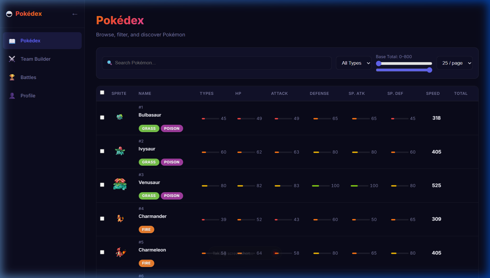
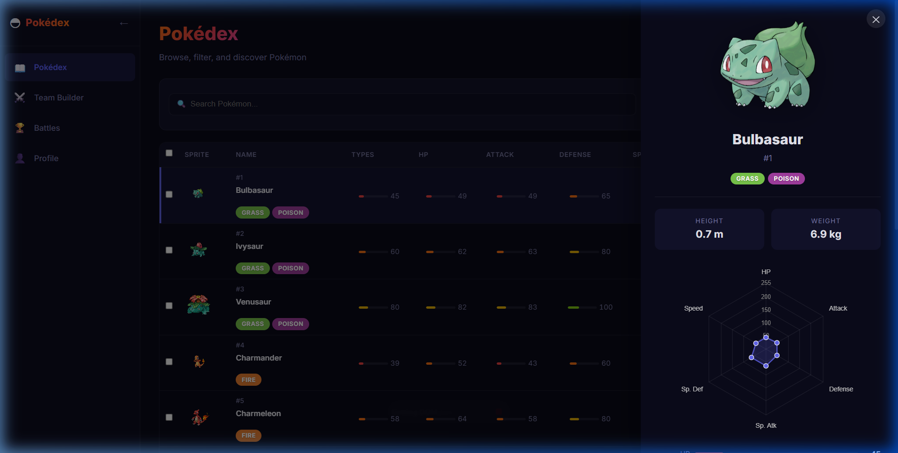
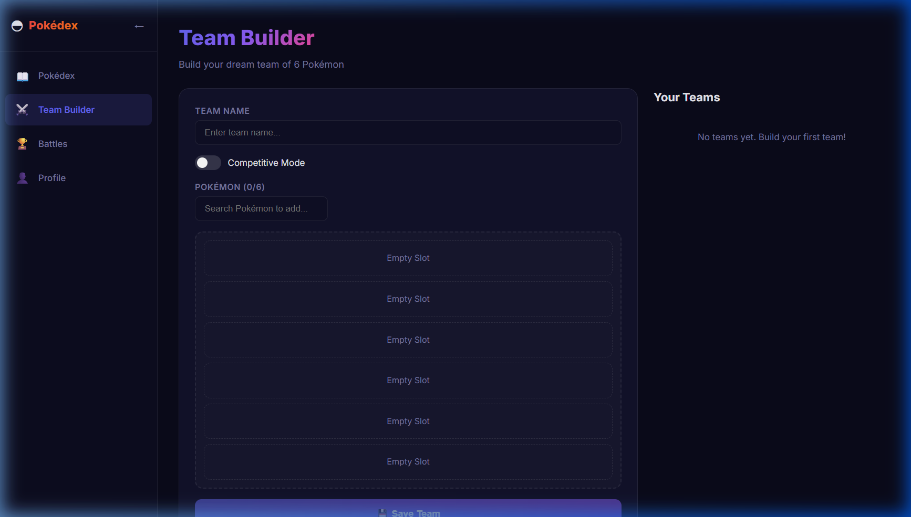
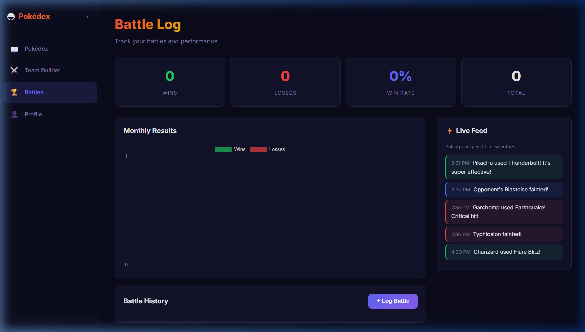
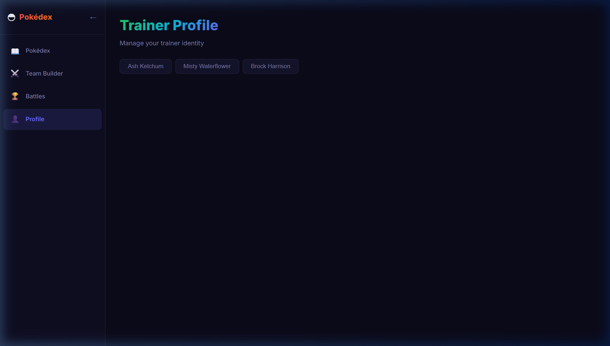

# Pokédex Trainer Dashboard

A full-featured **Angular 19** single-page application where a Pokémon trainer can browse Pokémon, build teams, track battles, and manage their trainer profile — all powered by **GraphQL**.


---

## 📸 Screenshots

### Pokédex — Browse, Filter & Sort


### Pokémon Detail Panel — Stats Radar Chart & Abilities


### Team Builder — Drag-and-Drop Assembly


### Battle Log — Telemetry Dashboard & Live Feed


### Trainer Profile — Multi-Trainer Management


---

## ✨ Features

### Core Requirements
- **GraphQL Integration** — Dual endpoints (PokéAPI public + local mock server)
- **RxJS State Management** — Custom BehaviorSubject stores with selectors, optimistic updates, and rollback
- **Angular Signals** — `signal()`, `computed()`, `effect()`, `toSignal()`, `input()`, `output()`
- **Interactive Charts** — Radar (stats), Bar (monthly battles), Doughnut (type distribution)
- **Advanced Form** — Team builder with autocomplete, validation, FormArray, competitive mode
- **Data Table** — Sortable, filterable, paginated Pokédex with multi-select
- **Video Player** — YouTube embed with DomSanitizer + Pokémon cry audio player
- **JSDoc Comments** — Every method in every `.ts` file

### Bonus Tasks Attempted
- ✅ **Bonus 2: Drag-and-Drop Team Builder** — CDK drag-drop for Pokémon team slots
- ✅ **Bonus 3: Type Effectiveness Directive** — `[appTypeHighlight]` highlights table rows
- ✅ **Bonus 5: Micro-Interaction Animations** — Staggered entries, route transitions, skeleton loaders, Pokéball spinner, toasts, sprite bounce

---

## 🏗 Architecture

```
src/app/
├── graphql/                 # GraphQL services & queries
│   ├── graphql-queries.ts   # All gql query/mutation definitions
│   ├── pokemon-api.service  # PokéAPI GraphQL service
│   └── local-api.service    # Local mock server service
├── state/                   # RxJS BehaviorSubject stores
│   ├── pokemon.store.ts     # Pokémon data store
│   ├── trainer.store.ts     # Trainer/team/battle store
│   ├── pokemon.selectors.ts # Derived observables
│   └── trainer.selectors.ts # Win rate, monthly stats
├── models/                  # TypeScript interfaces
├── shared/                  # Reusable UI components
│   ├── type-badge/          # Colored type pills
│   ├── skeleton-loader/     # Shimmer loading skeleton
│   ├── pokeball-spinner/    # Animated Pokéball loader
│   ├── toast/               # Toast notification system
│   └── audio-player/        # Pokémon cry audio player
├── directives/              # Custom directives
│   └── type-highlight.directive.ts
├── pipes/                   # Custom pipes
│   ├── pokemon-sprite.pipe.ts
│   └── stat-name.pipe.ts
└── features/                # Lazy-loaded feature views
    ├── pokedex/             # Pokédex table + detail panel
    ├── team-builder/        # Team builder with drag-drop
    ├── battle-log/          # Battle history + live feed
    └── trainer-profile/     # Profile management
```

### Data Flow

```
PokéAPI (GraphQL) ──► PokemonApiService ──► PokemonStore (BehaviorSubject)
                                               │
                                               ├──► PokemonSelectors (filtered/sorted/paginated)
                                               │         │
                                               │         └──► toSignal() ──► Components
                                               │
Local Mock Server ──► LocalApiService ──► TrainerStore (BehaviorSubject)
                                               │
                                               ├──► TrainerSelectors (winRate$, monthlyBattles$)
                                               │         │
                                               │         └──► toSignal() ──► Components
                                               │
                                               └──► Optimistic Updates + Rollback
```

---

## 🚀 Setup Instructions

### Prerequisites
- Node.js 18+
- npm 9+

### Installation

```bash
# Clone the repository
git clone https://github.com/Nizamuddin1N/pokedex-trainer-dashboard.git
cd pokedex-app

# Install dependencies
npm install
```

### Running the App

**1. Start the local mock GraphQL server:**
```bash
npx json-graphql-server db.js --port 4000
```

**2. Start the Angular dev server:**
```bash
ng serve
```

**3. Open in browser:**
Navigate to `http://localhost:4200`

### Running Tests
```bash
ng test
```

### Production Build
```bash
ng build
```

---

## 📡 GraphQL Endpoints

| Endpoint | URL | Purpose |
|---|---|---|
| PokéAPI (Public) | `https://beta.pokeapi.co/graphql/v1beta` | Read-only Pokémon data |
| Local Mock | `http://localhost:4000/` | Trainers, teams, battles (CRUD) |

---

## 🧪 Unit Tests (24 total, all passing)

| Test File | What It Tests | Count |
|---|---|---|
| `pokemon.store.spec.ts` | **Store method**: `loadPokemon()`, cache, filters, sort | 5 |
| `trainer.selectors.spec.ts` | **Selector**: `winRate$`, `battleStats$`, monthly breakdown | 3 |
| `app.component.spec.ts` | **Component signal**: `sidebarCollapsed()` signal state | 2 |
| `pokemon-sprite.pipe.spec.ts` | **Pipe**: sprite URL generation for all variants | 5 |
| `stat-name.pipe.spec.ts` | **Pipe**: stat name transformation (all 6 stats) | 5 |
| `toast.service.spec.ts` | **Service**: toast creation, dismissal, signals | 4 |

---

## 🎨 Design Decisions

- **Dark theme** with vibrant Pokémon-inspired accent colors
- **CSS custom properties** for consistent theming (no Tailwind)
- **Inter font** via Google Fonts for modern typography
- **Glassmorphism** cards with subtle borders and shadows
- **View Transitions API** for route change animations
- **Polling-based subscription** for real-time battle log feed

---

## 📦 Tech Stack

| Layer | Technology |
|---|---|
| Framework | Angular 19 (standalone, OnPush, Signals) |
| GraphQL | apollo-angular v13 + @apollo/client |
| State | Custom RxJS BehaviorSubject stores |
| Charts | ng2-charts v7 (Chart.js 4) |
| Drag & Drop | @angular/cdk v19 |
| Styling | Vanilla CSS with custom properties |
| Mock Server | json-graphql-server |
| Testing | Jasmine + Karma (24 tests) |
